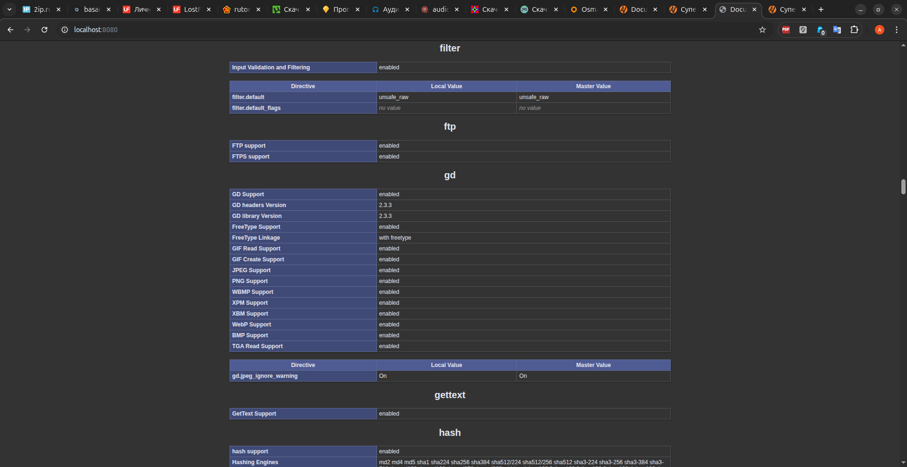

# Продвинутый Backend. Модуль 24. MVC.

Практическая работа

## Задание 24.5

- Реализована MVC-архитектура на примере сайта визитки.
- В рамках данной архитектуры добавлены статические страницы с информацией.
- Подключен пакет php-gd.

--------

## Используемые технологии

* HTML
* CSS
* PHP